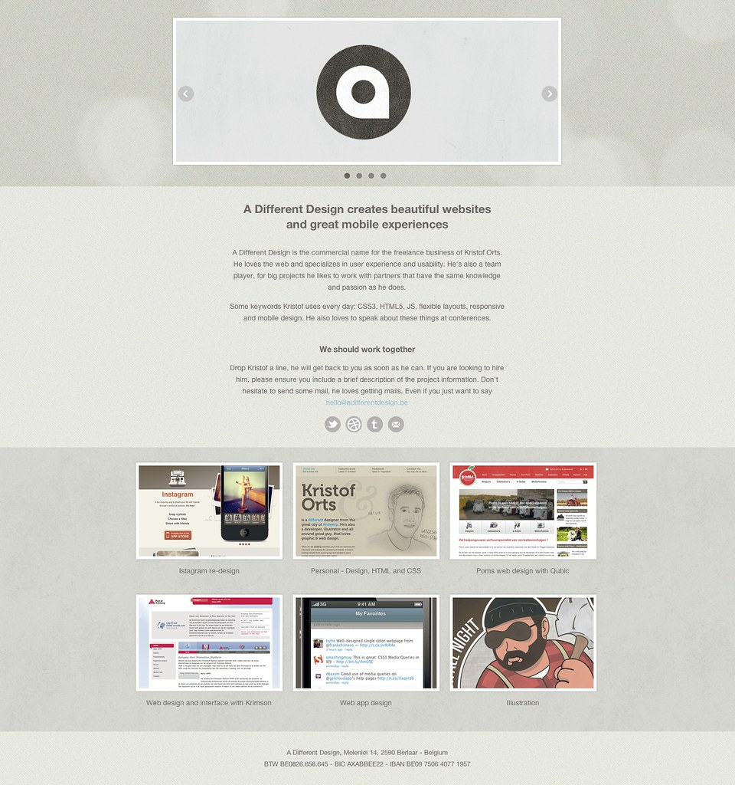

This article was first posted on [Truemark](https://truemark.com.np/blog/8-main-web-trends-for-2020)

<b>--------------------------------------------------------------------------------------------------------------------------------</b>

2020 is right at the corner. Along with it, we can see big shifts in web design. The standards of technology are rising every year. So, 2020 is all set to bring a lot of changes in web design. Everyone needs to be ready to meet the new demands of web design. So, are you ready?

Let’s see 8 web trends that will be trending in 2020.

## Minimalism

Minimalism has been around for some time. And, it is going to be a trending topic in web design in 2020. Web design is gradually shifting towards a clean and simple user interface. The website should be attractive and appealing with minimal elements. Minimalism involves clean text and minimum design elements such as hidden navigation bar, minimum colors, minimum buttons, and so on. Websites with minimal design are sure to rank higher in the search engines. Clean UI and simplicity ensures easy-to-navigate, faster page load, higher user engagement, etc.
 Example: Apple.

<!--  -->

## Chatbots

A chatbot is an artificial intelligence (AI) program designed to conduct a conversation with humans. As long as artificial intelligence continues to evolve, we expect to see chatbots becoming more advanced than ever. Chatbots are constantly being evolved so that the conversation becomes more realistic and no human is required to initiate a conversation with the visitors. They initiate conversation using pre-loaded phrases or text-based signals.
 Example: Spotify.

<!--  -->

## Voice user interfaces (VUIs)

Voice user interfaces are going to revolutionalize the web design trends to the next level. We can see the use of voice user interfaces but this is going to increase more in 2020. The users are able to interact with a system with minimum physical touch. It helps to navigate the website and make purchases faster and easier than it has ever been. This will help to boost the user experience.

You can see many reputed companies using voice assistants like Cortana, Alexa, Siri, etc. since more and more people are preferring voice-over text. It saves a lot of time since people don’t have to use their hands to navigate the website. It feels so convenient to navigate the website through voice rather than manually doing everything. And guess what? These features will be like an oasis in a desert for people with physical disabilities.
 Example: Amazon’s Alexa.

<!--  -->

## Asymmetric layouts

Designers have been taking web design to a whole new level. Every year we can see lots of designs creating hype. And one design to look for in 2020 is asymmetric layouts. Asymmetric layouts are becoming more and more appealing to users. Asymmetric layouts, also known as broken-grid layouts, are unique on their own where design elements are placed chaotically. This shows the creativity of web designers. Those who want their website to be unique will be looking forward to the asymmetric layouts.
 Example: Dada-Data.

<!--  -->

## Adaptive designs

Mobile devices have become an integral part of our daily life. And the use of mobile devices has increased and it will increase even more in the future. Looking at this trend, web designers should focus on designing responsive sites. Every designer and site owner’s focus should be on designing mobile-friendly sites.

People are preferring mobile devices over laptops and desktops for surfing the internet. And it is easier as well since it is small in size as compared to laptops and desktops. More traffic can be generated if sites are mobile-friendly since billions of people are using mobile devices.
 Example: BuzzFeed.

<!--  -->

## Push notifications

What do you think about the notifications from Facebook on your mobile’s notification panel? It’s useful, right. This help user to notify about the events that are occurring or going to occur. And this trend is going to increase in 2020.

It is better than email and SMS since it grabs the user’s attention quickly. You can reach your users a lot quicker. Push notifications can be the best medium to send valuable and high-priority information. Also, the site’s owners have more opportunities to communicate with their users through push notifications.
 Example: Facebook

<!--  -->

## Motion design

Motion design has been popular in recent years, but it is going to be a massive element in web design in 2020. It is more appealing and provides more information than text and even images. Motion design helps to enhance user experience.

If we see something moving whether it may be on a website or in our day to day life, it catches our attention quickly. So, motion design grabs the attention of the users when surfing a website. Right motion design helps to provide information more quickly.
 Example: Adidas Climazone.

<!--  -->

## Smart video

Video is one of the most engaging content on a website. It is not a new trend on the website but there is no content that provides valuable and appealing information. And it has always been popular in web design.

Videos are great but it needs to be taken to a whole new level. So, a new concept has arrived i.e. smart video - video that has a purpose. Video that shows what the site owner’s main goal is and what his/her organization does is more interesting than simply embedding a Youtube video. Such videos provide information to the users and are more value providing content.
 Example: CEI - The Digital Office.

<!--  -->

In 2020, we expect to see many more interesting web designs. More the technology advances, more web design trends we expect to see in 2020 that are unique and intriguing. These trends will create hype in the future. But, it is also possible that more web design trends will come on top besides these trends. If users respond positively, these trends will remain at the top in 2020 and beyond.

You should just choose those trends that fascinate you and are perfect for your website. If you cannot decide, then we, Truemark, will help you decide which trends are perfect for your website and looks more appealing. So if you want to work with us, please feel free to contact us through this link: [Truemark](https://truemark.com.np/)

Hope this article helped you.

**References:** [Merehead](https://merehead.com/blog/8-main-trends-of-web-design-2020/), [WishDesk](https://wishdesk.com/blog/web-design-trends-2020), [TheDigital](https://www.theedigital.com/blog/web-design-trends)

